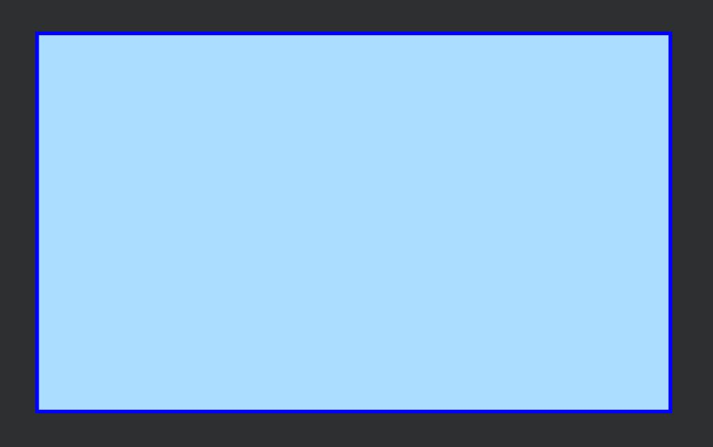
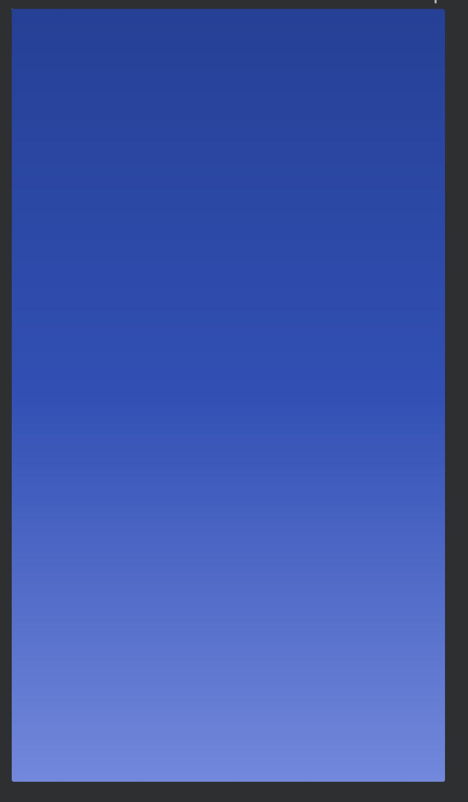
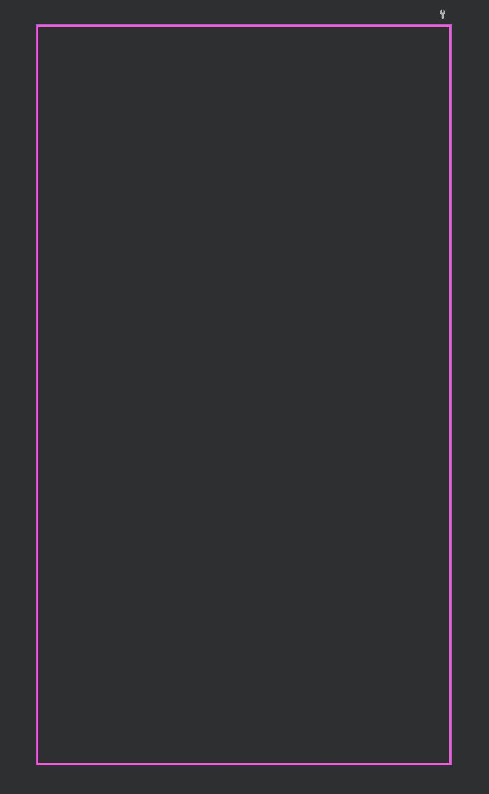

# Drawable

<br>

드로어블은 뷰에 설정할 수 있는 객체이며 그 위에 그래픽을 그릴 수 있다.

드로어블 XML 파일은 /app/res/drawable 폴더 안에 넣어 뷰의 배경으로 설정할 수 있다.

### 드로어블의 종류

<br>

-   비트맵 드로어블 : 이미지 파일을 보여줄 때 사용한다. <br><br>
-   상태 드로어블 : 상태별로 다른 그래픽을 참조할 수 있는 드로어블 <br><br>
-   전환 드로어블 : 두 개의 드로어블이 서로 바뀌도록 만들 수 있는 전환 드로어블 <br><br>
-   셰이프 드로어블 : 색상과 그라데이션을 포함하여 도형 모양을 정의할 수 있는 드로어블 <br><br>
-   인셋 드로어블 : 지정한 거리만큼 안쪽으로 들어오도록 만들 수 있는 드로어블 <br><br>
-   클립 드로어블 : 다른 드로어블을 클리핑할 수 있는 드로어블(레벨 값을 기준으로 한다.) <br><br>
-   스케일 드로어블 : 다른 드로어블의 크기를 바꿀 수 있는 드로어블(레벨 값을 기준으로 한다.)

<br>

<br>

## 상태 드로어블

<br>

```java
<?xml version="1.0" encoding="utf-8"?>
<selector xmlns:android="http://schemas.android.com/apk/res/android">

    <item android:state_pressed="true" android:drawable="@drawable/finger_pressed" />
    <item android:drawable="@drawable/finger" />
</selector>
```

<br>

xml파일 안에서 최상위 태그인 \<selector>태그 안에 \<item>태그 안에 drawable이 있다.

drawable 속성에는 state\_로 시작하는 속성이 있는데 **state_pressed**는 눌린 상태를 의미하고 **state_focused**는 포커스를 받은 상태를 의미한다.

**state_pressed**라는 상태 속성이 설정된 item 태그에는 drawable 속성 값으로 @drawable/finger_pressed을 입력하였다.

<br>

<br>

## 셰이프 드로어블

<br>

```java
<?xml version="1.0" encoding="utf-8"?>
<shape xmlns:android="http://schemas.android.com/apk/res/android"
    android:shape="rectangle">

    <size android:width="200dp" android:height="120dp"/>
    <stroke android:width="1dp" android:color="#0000ff"/>
    <solid android:color="#aaddff" />
    <padding android:bottom="1dp" />

</shape>
```

<br>



<br>

셰이프 드로어블은 최상위 태그가 \<selector>가 아니라 \<shape>태그이며 shape라는 속성을 추가한다.

위 코드는 속성값을 rectangle로 하였다.

<br>

### 속성들

-   size : 도형의 크기를 지정한다. <br><br>
-   stroke : 테두리선의 속성을 지정할 수 있다. <br><br>
-   solid : 도형의 안쪽을 채울 떄 사용한다. <br><br>
-   padding : 테두리 안쪽 공간을 띄울 때 사용한다. <br><br>

<br>

```java
<?xml version="1.0" encoding="utf-8"?>
<shape xmlns:android="http://schemas.android.com/apk/res/android">

    <gradient
        android:startColor="#7288DB"
        android:centerColor="#3250B4"
        android:endColor="#254095"
        android:angle="90"
        android:centerY="0.5"
        />

    <corners android:radius="2dp" />
</shape>
```

<br>



<br>

\<shape>태그 안에 \<gradient>태그를 넣으면 그라데이션이 만들어진다.

startColor에는 시작 부분의 색상, centerColor에는 가운데 부분의 색상, endColor에는 끝 부분의 색상을 지정할 수 있다.

<br>

<br>

```java
<?xml version="1.0" encoding="utf-8"?>
<layer-list xmlns:android="http://schemas.android.com/apk/res/android">

    <item>
        <shape android:shape="rectangle">
            <stroke android:width="1dp" android:color="#BE55DA" />
            <solid android:color="#00000000" />
        </shape>
    </item>

    <item android:top="1dp" android:bottom="1dp"
        android:right="1dp" android:left="1dp">
        <shape android:shape="rectangle">
            <stroke android:width="1dp" android:color="#FF55DA" />
            <solid android:color="#00000000" />
        </shape>
    </item>
</layer-list>
```

<br>



<br>

\<layer-list>태그 안에는 두 개의 \<item>태그가 있다. 첫 번째는 \<shape>태그 속성 값을 rectangle을 지정하였다.

두 번째는 top,bottom,right,left 속성을 지정하여 테두리 선으로부터 바깥으로 얼마만큼 공간을 띄울 것인지 정한다.

<br>

---
