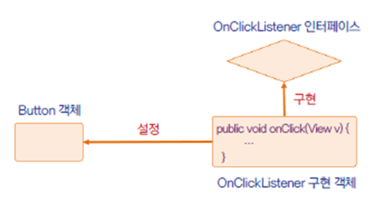
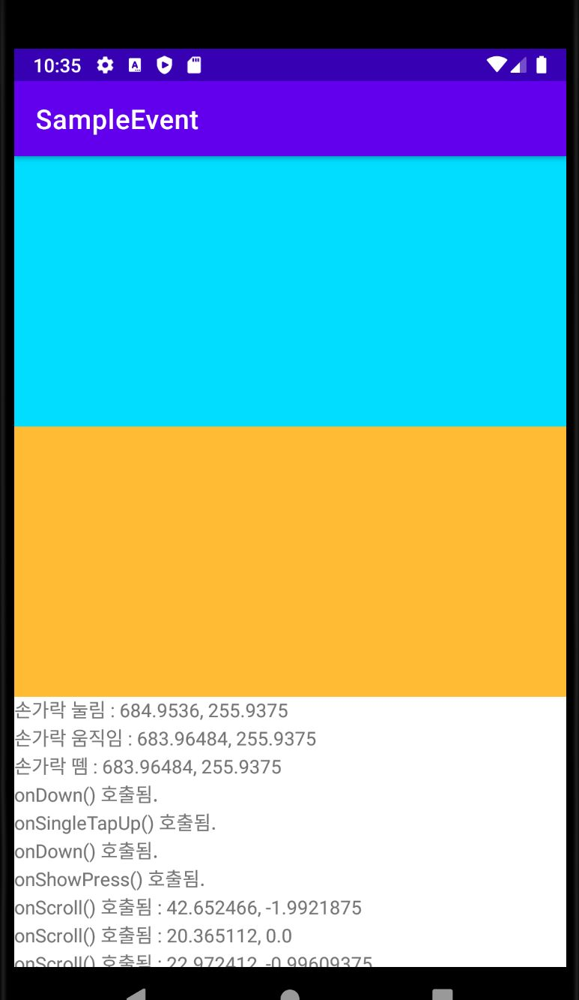

# 이벤트 처리 이해하기

<br>

## 이벤트 처리

<br>

안드로이드의 이벤트는 윈도우의 이벤트와 조금 다르다.

윈도우는 주로 마우스, 키보드로 조작하지만 안드로이드는 손가락 터치 방식으로 조작하기 때문이다.

따라서 안드로이드의 주요 이벤트는 실제 버튼이나 소프트 키패드를 누르면 발생하는 **Key Event**가 있다.

그런데 터치 이벤트는 단독으로 처리할 수 있는 이벤트가 아니다. 손가락으로 누를 때, 누른 상태에서 움직일 때, 누른 상태에서 뗄 때 모두 다르게 처리해야 한다. 따라서 터치 이벤트를 쉽게 처리할 수 있도록 **Click Event**를 별도로 제공한다.

<br>

예를 들어 버튼 태그에 onClick 속성을 추가하면 버튼을 클릭했을 때 발생하는 이벤트를 속성 값에서 메소드 이름을 넣는 방법으로 처리할 수 있다.

즉 XML이 아니라 소스 코드에서 클릭 이벤트를 처리하도록 하려면 버튼의 **setOnClickListener**메소드를 이용해 리스너를 설정할 수 있다.

이와 같은 이벤트 처리 방식은 화면에서 발생하는 이벤트를 버튼과 같은 위젯 객체에 전달한 후 그 이후의 처리 과정을 버튼에 **위임**한다고 해서 **위임 모델**이라고 부른다.

<br>



<br>

코드를 만들 때 사용하는 이 패턴은 각각의 뷰마다 하나의 이벤트 처리 루틴을 할당해 준다. 이렇게 하면 이벤트를 이벤트 루프에서 받아 처리할 때처럼 코드가 복잡해지지 않고 **이벤트를 위젯마다 개별적으로 처리하는** 객체 지향 코드를 만들 수 있다.

위임 모델은 각각의 이벤트를 처리할 수 있는 **리스너 인터페이스**를 등록할 수 있도록 한다. (onClickListener는 이벤트가 발생하면 즉시 동작할 수 있도록 만들어주는 리스너이다.)

<br>

### 이벤트 처리 메소드를

<br>

-   onTouchEvent : boolean onTouchEvent (MotionEvent event)
-   onKeyDown : boolean onKeyDown(int KeyCode, KeyEvent event)
-   onKeyUp : boolean onKeyUp (int KeyCode, KeyEvent event)

<br>

사용자가 화면을 터치하거나 키패드의 키를 하나 누르면 이벤트가 발생하고 파라미터로 필요한 정보들이 전달된다.

터치했을 때 발생하는 이벤트는 **MotionEvent**라 불리며 키를 입력했을 때는 KeyEvent가 전달된다.

이러한 메소드들은 뷰를 상속하여 새로운 클래스를 정의할 때 재정의할 수 있다.<br>
(만약 새로운 뷰를 정의하지 않고 기존의 뷰 객체에서 이벤트를 처리하려면 리스너를 설정하는 메소드를 호출해야한다.)

<br>

### 기존의 뷰 클래스를 그대로 사용하면서 그 객체에 설정하여 사용하는 메소드들

<br>

-   View.OnTouchListener : boolean onTouch(View v, MotionEvent event)
-   View.onKeyListenter : boolean onKey(View v, int KeyCode, KeyEvent event)
-   View.onClickListener : void onClick(View v)
-   View.onFocusChangeListener : void onFocusChangeListener(View v, boolean hasFocus)

<br>

<br>

### 대표적인 이벤트

-   터치 이벤트 : 화면을 손가락으로 누를 때 발생하는 이벤트
-   키 이벤트 : 키패드나 하드웨어 버튼을 누를 때 발생하는 이벤트
-   제스처 이벤트 : 터치 이벤트 중에서 스크롤과 같이 일정 패턴으로 구분하는 이벤트
-   포커스 : 뷰마다 순서대로 주어지는 포커스
-   화면 방향 변경 : 화면의 방향이 가로와 세로로 바뀜에 따라 발생하는 이벤트

<br>

---

<br>

## 터치 이벤트

<br>

```java
public class MainActivity extends AppCompatActivity {
    TextView textView;

    @Override
    protected void onCreate(Bundle savedInstanceState) {
        super.onCreate(savedInstanceState);
        setContentView(R.layout.activity_main);

        textView = findViewById(R.id.textView);

        View view = findViewById(R.id.view);

```

화면 위쪽에 배치한 뷰를 findViewById 메소드를 찾아 참조한 후 setOnClickListener메소드를 호출하여 리스너를 등록한다.

이 메소드를 호출할 때 파라미터로 리스너 객체를 전달하는데 new 연산자를 이용해 OnTouchListener 객체를 생성하면서 전달한다. 그러면 뷰가 터치되었을 때 이 리스너 객체의 onTouch 메소드가 자동으로 호출된다.

```java
        view.setOnTouchListener(new View.OnTouchListener() {
            @Override
            public boolean onTouch(View view, MotionEvent motionEvent) {
                int action = motionEvent.getAction();
                float curX = motionEvent.getX();
                float curY = motionEvent.getY();

                if (action == MotionEvent.ACTION_DOWN) {
                    println("손가락 눌림 : " + curX + ", " + curY);
                } else if (action == MotionEvent.ACTION_MOVE) {
                    println("손가락 움직임 : " + curX + ", " + curY);
                } else if (action == MotionEvent.ACTION_UP) {
                    println("손가락 뗌 : " + curX + ", " + curY);
                }

                return true;
            }
        });


    public void println(String data) {
        textView.append(data + "\n");
    }
}
```

onTocuh 메소드로는 MotionEvent 객체가 파라미터로 전달된다. 여기에는 액션 정보나 터치한 곳의 좌표가 들어있다.

액션 정보는 **getAction** 메소드로 확인할 수 있으며 손가락이 눌렸는지 눌린 상태로 움직이는지, 또는 손가락이 떼졌는지를 알 수 있도록 한다.

<br>



<br>

<br>

<br>

## 제스처 이벤트

<br>

-   onDown() : 화면이 눌렸을 경우 <br><br>
-   onShowPress() : 화면이 눌렸다 떼어지는 경우 <br><br>
-   onSingleTapUp() : 화면이 한 손가락으로 눌렸다 떼어지는 경우<br><br>
-   onSingleTapConfirmed() : 화면이 한 손가락으로 눌려지는 경우<br><br>
-   onDoubleTap() : 화면이 두 손가락으로 눌려지는 경우<br><br>
-   onDoubleTapEvent() : 화면이 두 손가락으로 눌려진 상태에서 떼거나 이동하는 등 세부적인 액션이 취하는 경우<br><br>
-   onScroll() : 화면이 눌린 채 가속도를 붙여 손가락을 움직였다 떼는 경우<br><br>
-   onLongPress() : 화면을 손사락으로 오래 누르는 경우<br><br>
-   onFling() : 빠른 속도로 스크롤을 하는 경우 **(스크롤은 이동한 거리값을 따지고, 플링은 이동한 속도를 따진다.)**

<br>

<br>

```java
public class MainActivity extends AppCompatActivity {
    TextView textView;

    GestureDetector detector;

    @Override
    protected void onCreate(Bundle savedInstanceState) {
        super.onCreate(savedInstanceState);
        setContentView(R.layout.activity_main);

        textView = findViewById(R.id.textView);

        View view = findViewById(R.id.view);
        view.setOnTouchListener(new View.OnTouchListener() {
            @Override
            public boolean onTouch(View view, MotionEvent motionEvent) {
                int action = motionEvent.getAction();
                float curX = motionEvent.getX();
                float curY = motionEvent.getY();

                if (action == MotionEvent.ACTION_DOWN) {
                    println("손가락 눌림 : " + curX + ", " + curY);
                } else if (action == MotionEvent.ACTION_MOVE) {
                    println("손가락 움직임 : " + curX + ", " + curY);
                } else if (action == MotionEvent.ACTION_UP) {
                    println("손가락 뗌 : " + curX + ", " + curY);
                }

                return true;
            }
        });

        detector = new GestureDetector(this, new GestureDetector.OnGestureListener() {
            @Override
            public boolean onDown(MotionEvent motionEvent) {
                println("onDown() 호출됨.");
                return true;
            }

            @Override
            public void onShowPress(MotionEvent motionEvent) {
                println("onShowPress() 호출됨.");
            }

            @Override
            public boolean onSingleTapUp(MotionEvent motionEvent) {
                println("onSingleTapUp() 호출됨.");
                return true;
            }

            @Override
            public boolean onScroll(MotionEvent motionEvent, MotionEvent motionEvent1, float v, float v1) {
                println("onScroll() 호출됨 : " + v + ", " + v1);
                return true;
            }

            @Override
            public void onLongPress(MotionEvent motionEvent) {
                println("onLongPress() 호출됨.");
            }

            @Override
            public boolean onFling(MotionEvent motionEvent, MotionEvent motionEvent1, float v, float v1) {
                println("onFling() 호출됨 : " + v + ", " + v1);
                return true;
            }
        });

        View view2 = findViewById(R.id.view2);
        view2.setOnTouchListener(new View.OnTouchListener() {
            @Override
            public boolean onTouch(View view, MotionEvent motionEvent) {
                detector.onTouchEvent(motionEvent);
                return true;
            }
        });
}
```

view2에는 OntouchListener 객체를 설정한다 따라서 객채를 터치하면 자동으로 onTouch 메소드가 호출된다.

onTouch 메소드 안에서는 **GestureDetector** 객체의 **onTouchEvent** 메소드를 호출하면서 **MotionEvent** 객체를 전달한다.

이렇게 하면 GestureDetector 객체가 터치 이벤트를 처리한 후 객체에 정의된 메소드를 호출한다.

<br>

<br>

<br>

## 키 이벤트

<br>

```java
 @Override
    public boolean onKeyDown(int keyCode, KeyEvent event) {
        if (keyCode == KeyEvent.KEYCODE_BACK) {
            Toast.makeText(this, "시스템 [BACK] 버튼이 눌렸습니다.", Toast.LENGTH_LONG).show();

            return true;
        }

        return false;
    }
```

<br>

키 입력은 onKeyEvent 메소드를 재정의하여 처리할 수 있다.

파라미터는 두 개이며 KeyCode는 어떤 키가 사용되는지, KeyEvent는 키 입력 시 이벤트에 대한 정보를 알고 싶을 때 사용된다.

<br>

### KeyCode

<br>

-   KEYCODE_DPAD_LEFT : 왼쪽 화살표
-   KEYCODE_DPAD_RIGHT : 오른쪽 화살표
-   KEYCODE_DPAD_UP : 위쪽 화살표
-   KEYCODE_DPAD_DOWN : 아래쪽 화살표
-   KEYCODE_DPAD_CENTER : 중앙 버튼
-   KEYCODE_CALL : 통화 버튼
-   KEYCODE_ENDCALL : 통화 종료 버튼
-   KEYCODE_BACK : 뒤로 가기 버튼
-   KEYCODE_VOLUME_UP : 음량 증가 버튼
-   KEYCODE_VOLUME_DOWN : 음량 감소 버튼

<br>

<br>

<br>

---
