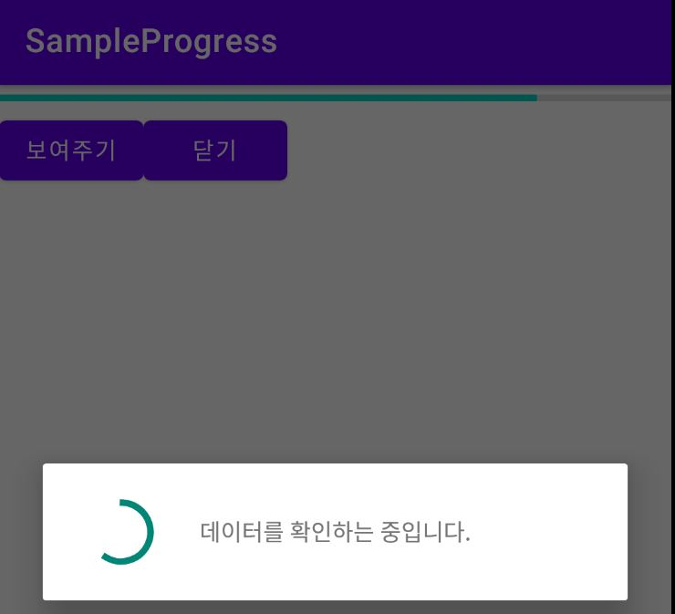

# 프로그레스바

<br>

어떤 일의 진행 상태를 중간 중간 보여줄 수 있는 좋은 방법 중 하나가 프로그레스바이다.

프로그레스바는 작업의 진행 정도를 표시하거나 작업이 진행 중임을 사용자게에 알려준다.

<br>

-   막대 모양 : 작업의 진행 정도를 알려줄 수 있도록 막대 모양으로 표시한다.<br> style 속성 값을 "?android:attr/progressBarStyleHorizontal"로 표시한다. <br><br>
-   원 모양 : 작업이 진행 중임을 알려준다. 원 모양으로 된 프로그레스바가 반복적으로 표시된다.

<br>

프로그레스바를 추가할 때는 \<ProgressBar> 태그가 사용되는데, 프로그레스바가 갖는 값의 최대 범위는 **max**속성으로 설정하고 현재 값은 **progress**속성으로 설정한다.

```java
void setProgress(int progress)
void incrementProgressBy(int diff)
```

<br>

setProgress 메소드는 정수 값을 받아 프로그레스바의 현재 값으로 설정한다.

incrementProgressBy 메소드는 현재 설정되어 있는 값을 기준으로 더하거나 뺄 때 사용한다.

<br>

프로그레스바는 항상 보일 필요는 없으므로 화면에서 차지하는 공간을 줄일 수 있도록 타이틀 바에 프로그레스바를 표시할 수도 있다.

```java
requestWindowFeature(Window.FEATURE_PROGRESS);
```

**타이틀 부분에 표시되는 프로그레스바는 범위를 따로 지정할 수 없다.**

디폴트 값으로는 0부터 10000사이의 값을 가질 수 있다.

<br>



<br>

<br>

```java
public class MainActivity extends AppCompatActivity {
    ProgressDialog dialog;

    @Override
    protected void onCreate(Bundle savedInstanceState) {
        super.onCreate(savedInstanceState);
        setContentView(R.layout.activity_main);

        ProgressBar progressBar = findViewById(R.id.progressBar); //프로그레스바 객체 참조
        progressBar.setIndeterminate(false);
        progressBar.setProgress(80);
```

<br>

XML 레이아웃에 들어있는 프로그레스바를 findViewById 메소드로 찾은 후 그 값을 80으로 설정한다.

<br>

```java
        Button button = findViewById(R.id.button);
        button.setOnClickListener(new View.OnClickListener() {
            @Override
            public void onClick(View view) {
                dialog = new ProgressDialog(MainActivity.this); // 프로그레스 대화상자 객체 만들고 설정
                dialog.setProgressStyle(ProgressDialog.STYLE_SPINNER);
                dialog.setMessage("데이터를 확인하는 중입니다.");
                dialog.show();
            }
        });
```

<br>

버튼을 클릭했을 때는 프로그레스바 대화상자가 표시되도록 한다.
<br>멈추지 않는 프로그레스바를 대화상자 안에서 보여주려면 ProgressDialog 객체를 하나 만들고 그 스타일을
<br>**ProgressDialog.STYLE_SPINNER**로 설정한다.

이렇게 만든 ProgressDialog 객체는 show 메소드를 호출하면 화면에 표시된다.

ProgressDialog 객체를 생성할 때는 Context 객체가 파라미터로 전달되어야 하는데 액티비티인 MainActivity 객체를 전달하기 위해서는 파라미터를 **MainActivity.this**로 지정한다.

<br>

```java

        Button button2 = findViewById(R.id.button2);
        button2.setOnClickListener(new View.OnClickListener() {
            @Override
            public void onClick(View view) {
                if (dialog != null) { //프로그레스 대화상자 없애기
                    dialog.dismiss();
                }
            }
        });

    }

}
```

<br>

프로그레스 대화상자가 보이는 영역 밖을 터치하면 프로그레스바는 없어진다.

그러나 어떤 이벤트가 발생했을 때 대화상자를 보이지 않게 하려면 **dismiss**메소드를 호출하면 된다.

[닫기]버튼은 화면에 표시된 ProgressDialog를 닫는 dismiss메소드를 호출한다.

<br>

<br>

<br>

---
