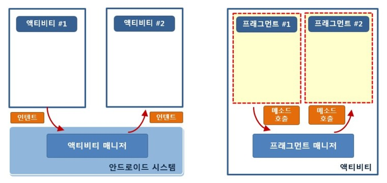

# Fragment

<br>

프래그먼트는 하나의 화면을 여러 부분으로 나눠서 보여주거나 각각의 부분 화면 단위로 바꿔서 보여주고 싶을 때 사용한다.

프래그먼트를 사용하는 가장 큰 목적은 분활된 화면들을 독립적으로 구성하고 그 상태를 관리하는데 있다.

**프래그먼트의 '화면'과 액티비티에서 사용하는 '화면'은 서로 다른 것을 가르킨다. 똑같이 XML 레이아웃을 만들지만 액티비티에서 사용되면 시스템에서 관리하는 화면이고, 프래그먼트에서 사용되면 단순히 액티비티 위에 올라가는 화면의 일부, 즉 '부분 화면'이 된다.**

**프래그먼트는 항상 액티비티 위에 올라가 있어야 한다.**

따라서 프래그먼트가 동작하는 시점은 액티비티에 프래그먼트가 올라가는 시점이다.

<br>



<br>

액티비티는 안드로이드 시스템에서 관리한다. 액티비티 매니저가 액티비티의 동작 순서나 처리 방식을 결정하므로 시스템이 이해하는 형식인 Intent로 명령이나 데이터를 만들어보낸다.

즉, 액티비티는 액티비티 매니저에 의해 독립적으로 동작한다. 이러한

<br>

프래그먼트는 시스템이 하던 역할을 액티비티가 한다. 프래그먼트 매니저가 프래그먼트들을 관리하는데 Intent가 하던 역할은 단순히 메소드를 만들고 메소드를 호출하는 방식으로 대신한다.

<br>

<br>

## 프래그먼트를 화면에 추가하기

<br>

프래그먼트 또한 하나의 XML 레이아웃과 하나의 자바 소스파일로 동작한다.

<br>


<br>

### 프래그먼트 코드

```java
public final Activity getActivity()
// 이 프래그먼트를 포함하는 액티비티를 반환한다.

public final FragmentManager getFragmentManager()
// 이 프래그먼트를 포함하는 액티비티에서 프로그먼트 객체들과 의사소통하는 프래그먼트 매니저를 반환한다.

public final Fragment getParentFragment()
// 이 프래그먼트를 포함하는 부모가 프래그먼트일 경우 리턴한다. 액티비티면 NULL을 반환한다.

public final int getId()
// 이 프래그먼트의 ID를 반환한다.
```

<br>

프래그먼트를 위한 클래스까지 만들었다면 XML 레이아웃 파일의 내용을 소스 파일과 연결하는 과정이 필요하다

액티비티에서는 setContentView 메소드가 있지만 프래그먼트에서는 없으므로 **LayoutInfalter**를 사용해 인플레이션을 진행해야 한다.

XML 레이아웃 파일의 내용을 인플레이션 한 후 클래스에서 사용하는 코드는 **onCreateView** 메소드 안에 들어간다.

그리고 onCreateView 메소드는 콜백 메소드로 인플레이션이 필요한 시점에 자동으로 호출된다.<br>

따라서 이 메소드 안에서 인플레이션을 위한 inflate 메소드를 호출하면 되고 인플레이션이 끝나면 프래그먼트가 하나의 뷰처럼 동작할 수 있는 상태가 된다.

<br>

<br>

activity_main.xml 파일에 직접 \<fragment> 태그를 사용해 프래그먼트를 추가할 수도 있고, 새로 정의한 프래그먼트 클래스의 인스턴스 객체를 new 연산자로 만든 후 FragmentManager 객체의 add 메소드를 사용해 액티비티에 추가할 수도 있다.

<br>

<br>

### 프래그먼트 매니저

<br>

```java
public abstract FragmentTransaction beginTransaction ()
// 프래그먼트를 변경하기 위한 트랜잭션을 시작한다.

public abstract Fragment findFragmentById (int id)
// ID를 이용해 프래그먼트 객체를 찾는다.

public abstract Fragment findFragmentByTag (String tag)
// 태그 정보를 사용해 프래그먼트 객체를 찾음

public abstract boolean executePendingTransactions ()
// 트랜잭션은 commit 메소드를 호출하면 실행되지만 비동기방식으로 실행되므로 즉시 실행하고 싶다면 이 메소드를 추가로 호출해야 한다.
```

<br>

FragmentManager 객체는 프래그먼트를 액티비티에 추가, 다른 프래그먼트로 바꾸거나 또는 삭제할 때 주로 사용한다.

<br>

<br>

```java
// MainFragment
 public View onCreateView(LayoutInflater inflater, @Nullable ViewGroup container, @Nullable Bundle savedInstanceState) {
        ViewGroup rootView = (ViewGroup) inflater.inflate(R.layout.fragment_main, container, false);
```

onCreateView 메소드의 파라미터로 LayoutInflater 객체가 전달되므로 이 객체의 inflate 메소드를 바로 호출할 수 있다.

첫 번째 파라미터는 XML 레이아웃 파일이 되므로 R.layout.fragment_main이 입력된다.

두 번째 파라미터는 XML 레이아웃이 설정될 뷰그룹 객체가 되는데 onCreateView 메소드로 전달되는 두 번째 파라미터가 이 프래그먼트의 가장 상위 레이아웃이 된다.

<br>

<br>

```java
<FrameLayout xmlns:android="http://schemas.android.com/apk/res/android"
    android:id="@+id/container"
    android:layout_width="match_parent"
    android:layout_height="match_parent">

    <fragment
        android:id="@+id/mainFragment"
        android:name="org.techtown.fragment.MainFragment"
        android:layout_width="match_parent"
        android:layout_height="match_parent" />
</FrameLayout>
```

프래그먼트는 뷰와 달라서 뷰를 담고 있는 공간만 확보한다. 따라서 태그 이름으로 프래그먼트의 이름을 사용할 수 없다.

/271
