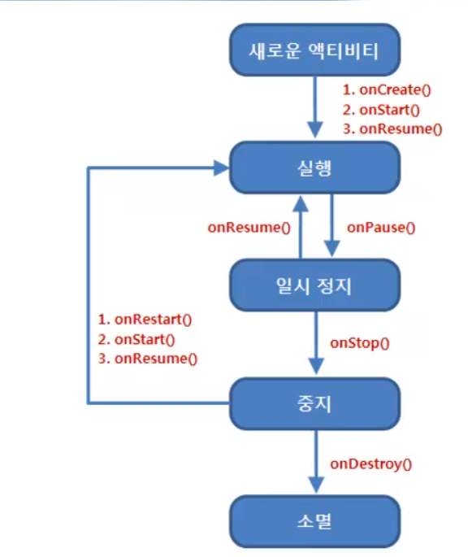

# 액티비티 수명주기와 SharedPreferences 이해하기

<br>

액티비티를 실행할 때 이전에 실행한 액티비티는 액티비티 스택에 보관하다가 현재 화면에 보이는 액티비티가 사라지면 다시 이전 액티비티가 동작하는 과정을 거친다.

따라서 이 때문에 하나의 액티비티가 화면에 보이거나 보이지 않게 될 때 다른 액티비티의 상태에 영향을 미칠 수 있다.

액티비티는 처음 실행될 때 메모리에 만들어지는 과정부터 시작하여 실행과 중지, 그리고 메모리에서 해제되는 여러 과정의 상태 정보로 갖고 있으며 이런 상태 정보는 시스템이 관리하면서 각각의 상태에 해당하는 메소드를 자동 호출하게 된다.

<br>

<br>

액티비티의 대표적인 상태 정보

-   실행(Running) : 화면상에 액티비티가 보이면서 실행되어 있는 상태. 액티비티 스택의 최상위에 있으면 **포커스를 가지고 있다.** <br><br>
-   일시 정지(Paused) : 사용자에게 보이지만 다른 액티비티가 위에 있어 **포커스를 받지 못하는 상태**.<br>대화상자가 위에 있어 일부가 가려진 경우에 해당한다.<br><br>
-   중지(Stopped) : 다른 액티비티에 의해 완전히 가려져 보이는 상태

<br>

<br>

이렇게 액티비티의 상태 정보가 변화하는 것을 **액티비티의 수명주기**라고 한다.

<br>



<br>

### 액티비티 상태 메소드

<br>

-   onCreate <br>액티비티가 처음에 만들어졌을 때 호출한다.<br>화면에 보이는 뷰들의 일반적인 상태를 설정하는 부분<br>이전 상태가 저장되어 있는 경우에는 번들 객체를 참조하여 이전 상태 복원 가능<br>이 메소드 다음에는 **항상 onStart 메소드가 호출된다.** <br><br>
-   onStart <br>액티비티가 화면에 보이기 바로 전에 호출된다.<br>액티비티가 화면 상에 보이면 이 메소드 다음에 onResume 메소드가 호출된다.<br>액티비티가 화면에서 가려지게 되면 이 메소드 다음에 onStop 메소드가 호출된다. <br><br>
-   onResume <br>액티비티가 사용자와 상호작용하기 바로 전에 호출된다.<br><br>
-   onRestart <br>액티비티가 중지된 이후에 호출되는 메소드로 다시 시작하기 바로 전에 호출된다.<br>**이 메소드 다음에는 항상 onStart 메소드가 호출된다.**<br><br>
-   onPause <br>또 다른 액티비티를 시작하려고 할 때 호출된다.<br>저장되지 않은 데이터를 저장소에 저장하거나 애니메이션 작업을 중지하는 등의 기능을 수행하는 메소드이다.<br>이 메소드가 리턴하기 전에는 다음 액티비티가 시작될 수 없으므로 이 작업은 매우 빨리 수행된 후 리턴되어야 한다.<br>액티비티가 이 상태에 들어가면 시스템은 액티비티를 강제로 종료할 수 있다.<br><br>
-   onStop <br>액티비티가 사용자에게 더 이상 보이지 않을 때 호출된다.<br>액티비티가 소멸하거나 또 다른 액티비티가 화면을 가릴 때 호출된다.<br>액티비티가 이 상태에 들어가면 시스템은 액티비티를 강제로 종료할 수 있다.<br><br>
-   onDestroy <br>액티비티가 소멸되어 없어지기 전에 호출된다.<br>이 메소드는 액티비티가 받는 마지막 호출이 된다.<br>액티비티가 앱에 의해 종료되거나(finish 메소드 호출) 시스템이 강제로 종료시키는 경우에 호출될 수 있다.<br><br>

<br>

onPause와 onResume 메소드는 앱이 멈추거나 없어질 때, 그리고 앱이 다시 보이거나 새로 실행될 때 호출되므로 이 두 가지 메소드를 구현하여 앱의 상태를 저장하거나 복원해야 한다.

위 방법 외에도 액티비티를 중지시키기 전에 호출되는 **onSaveInstanceState** 메소드를 이용해 데이트를 임시로 저장할 수도 있다.

이 메소드의 파라미터로 전달되는 번들 객체를 이용해 데이터를 저장하면 onCreate 메소드나 **onRestoreInstanceState** 메소드로 저장했던 데이터가 전달된다.

<br>

<br>

앱을 실행하면

**onCreate -> onStart -> onResume** 순서로 호출되고

시스템 [BACK] 버튼을 눌러 화면을 없앨 때는 **onPause -> onStop -> onDestroy**순으로 호출된다.

<br>

화면이 전환될 때는 MainActivity의 onDestroy 메소드가 호출되지 않고, 스택으로 들어간 액티비티는 onResume 메소드가 호출되면서 화면으로 보이게 된다.

이와 같은 상태에 따른 콜백 메소드가 바론 onResume과 onPause 메소드이다.

액티비티가 전환될 때에도 데이터를 저장하기 위해서 onPause 메소드 안에서 데이터를 저장하고, onResume 메소드 안에서 복원하는 방식을 처리한다.

<br>

<br>

<br>

```java
public class MainActivity extends AppCompatActivity {
    EditText nameInput;

    @Override
    protected void onCreate(Bundle savedInstanceState) {
        super.onCreate(savedInstanceState);
        setContentView(R.layout.activity_main);

        nameInput = findViewById(R.id.nameInput);

        Button button = findViewById(R.id.button);
        button.setOnClickListener(new View.OnClickListener() {
            @Override
            public void onClick(View v) {
                Intent intent = new Intent(getApplicationContext(), MenuActivity.class);
                startActivity(intent);
            }
        });

        Toast.makeText(this, "onCreate 호출됨", Toast.LENGTH_LONG).show();
        println("onCreate 호출됨");
    }

    @Override
    protected void onStart() {
        super.onStart();

        Toast.makeText(this, "onStart 호출됨", Toast.LENGTH_LONG).show();
        println("onStart 호출됨");
    }

    @Override
    protected void onStop() {
        super.onStop();

        Toast.makeText(this, "onStop 호출됨", Toast.LENGTH_LONG).show();
        println("onStop 호출됨");
    }

    @Override
    protected void onDestroy() {
        super.onDestroy();

        Toast.makeText(this, "onDestroy 호출됨", Toast.LENGTH_LONG).show();
        println("onDestroy 호출됨");
    }

    @Override
    protected void onPause() {
        super.onPause();

        Toast.makeText(this, "onPause 호출됨", Toast.LENGTH_LONG).show();
        println("onPause 호출됨");

        saveState(); //현재 상자에 입력된 데이터를 저장한다.
    }

    @Override
    protected void onResume() {
        super.onResume();

        Toast.makeText(this, "onResume 호출됨", Toast.LENGTH_LONG).show();
        println("onResume 호출됨");

        restoreState(); // 설정 정보에 저장된 데이터를 복원한다.
    }

    public void println(String data) {
        Toast.makeText(this, data, Toast.LENGTH_LONG).show();
        Log.d("Main", data);
    }
```

앱 안에서 간단한 데이터를 저장하거나 복원할 때는 **SharedPreferences**를 사용한다.

이는 앱 내부에 파일 하나 만드는데 이 파일 안에서 데이터를 저장하거나 읽어올 수 있게 한다.

```java
    protected void saveState() {
        SharedPreferences pref = getSharedPreferences("pref", Activity.MODE_PRIVATE);
        SharedPreferences.Editor editor = pref.edit();
        editor.putString("name", nameInput.getText().toString());
        editor.commit();
    }

    protected void clearState() {
        SharedPreferences pref = getSharedPreferences("pref", Activity.MODE_PRIVATE);
        SharedPreferences.Editor editor = pref.edit();
        editor.clear();
        editor.commit();
    }
}
```

**saveState** 메소드는 현재 입력상자에 입력된 데이터를 저장한다.

데이터를 저장할 때는 SharedPreferences를 사용하며 pref 문자열을 저장소의 이름으로 사용한다.

SharedPreferences 객체를 사용하려면 **getSharedPreferences** 메소드로 참조한다.

<br>

SharedPreferences.Editor 객체는 데이터를 저장할 수 있도록 edit 메소드를 제공하는데 edit 메소드를 호출한 후 putXXX 메소드로 저장하려는 데이터를 설정할 수 있다.

데이터를 저장한 후에는 commit 메소드를 호출해야 실제로 저장된다.

<br>

<br>

```java
    protected void restoreState() {
        SharedPreferences pref = getSharedPreferences("pref", Activity.MODE_PRIVATE);
        if ((pref != null) && (pref.contains("name"))) {
            String name = pref.getString("name", "");
            nameInput.setText(name);
        }
    }
```

**restoreState** 메소드는 설정 정보에 저장된 데이터를 가져와서 토스트 메시지로 보여준다.

이렇게 상태 정보를 담고 있는 데이터를 저장하고 다시 복원하기 위해서 만든 saveState와 restoreState 메소드는 onPause와 onResume 메소드에 들어가야 한다.

<br>

<br>

<br>

---
