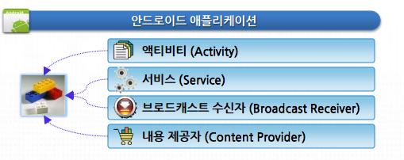
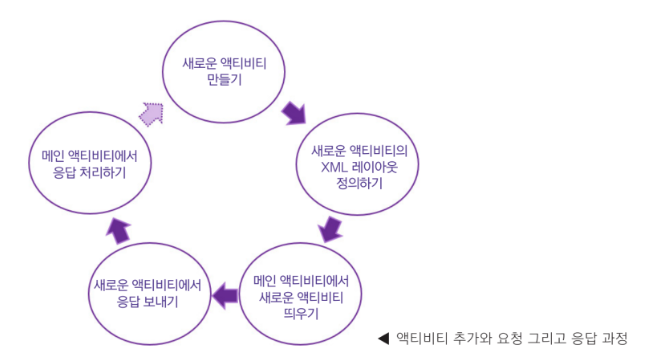

# Activity

<br>

안드로이드 앱을 구성하는 요소에는 4가지가 있다.

<br>



<br>

이 4가지 요소들을 포함하는 정보들은 **AndroidManifest.xml**파일에 담겨있다.

앞으로 Activity를 추가하기 위해서는 AndroidManifest 파일에 새 액티비티 정보를 추가해야 한다.

<br>

## 액티비티 추가와 요청 그리고 응답과정

<br>

액티비티 간의 전환은 다음과 같다.

<br>



<br>

-   ### 새로운 액티비티 만들기<br> 새로운 액티비티를 추가하면 XML 레이아웃 파일 하나와 자바 소스 파일 하나가 만들어지고 Manifest 파일에 액티비티 태그가 추가된다. <br> <br>
-   ### 새로운 액티비티의 XML 레이아웃 정의하기<br> 새로 만들어진 XML 레이아웃을 수정하여 새로운 액티비티의 화면이 어떻게 배치될지를 작성한다. <br> <br>
-   ### 메인 액티비티에서 새로운 액티비티 띄우기<br> 메인 액티비티의 버튼을 클릭하면 startActivityForResult 메소드로 새로운 액티비티를 띄운다. <br> <br>
-   ### 새로운 액티비티에서 응답 보내기<br> 새로운 액티비티가 보이고 그 안에 들어 있는 버튼을 클릭하면 setResult 메소드로 응답을 보낸다. <br> <br>
-   ### 응답 처리하기<br> 메인 액티비티에서 onActivityResult 메소드를 재정의하여 새로 띄웠던 액티비티에서 보내오는 응답을 처리한다.

<br>

<br>

액티비티를 소스 코드에서 띄울 때는 **startActivity** 메소드를 사용하면 된다.

이 메소드는 단순히 액티비티를 띄워 화면에 보이도록 만든다. 그러나 여러 화면들을 다루어야될 상황이 오면

단순히 액티비티를 띄워주기만 할 뿐만 아니라 액티비티의 구분, 액티비티 간의 전환을 위해 응답을 받아 처리하는 코드가 필요하게 된다

이런 기능은 **startActivityForResult** 메소드를 사용해야 한다.

이 메소드는 startActivity처럼 새 액티비티를 띄우지만 새 액티비티로부터 응답을 받을 수 있다.

<br>

```java
startActivityForResult(Intent intent, int requestCode)
```

<br>

이 메소드에 전달되는 파라미터는 인텐트와 **requestCode**인데 **requestCode**는 액티비티를 구별할 때 사용한다.

두 번째 파라미터인 **requestCode**는 새 액티비티를 띄울 때 보낼 요청 코드인데 액티비티가 여러 개이면 중복되지 않게 코드값을 정해야 한다.
<br>

<br>

```java
//MenuActivity
public class MenuActivity extends AppCompatActivity {

    @Override
    protected void onCreate(Bundle savedInstanceState) {
        super.onCreate(savedInstanceState);
        setContentView(R.layout.activity_menu);

        Button button = findViewById(R.id.button); //버튼 객체 참조
        button.setOnClickListener(new View.OnClickListener() {
            public void onClick(View v) {
                Intent intent = new Intent(); //인텐트 객체 생성하고 name의 값을 부가 데이터로 넣기
                intent.putExtra("name", "mike"); //응답 보내기
                setResult(RESULT_OK, intent);

                finish(); //현재 액티비티 없애기
            }
        });

    }
}

```

<br>

버튼을 클릭했을 때 호출되는 onClick 메소드 안에서는 Intent 클래스를 사용해 객체를 하나 만든 후 setResult 메소드를 호출하고 있다.

**setResult** 메소드는 새로 띄운 액티비티에서 이전 액티비티로 인텐트를 전달하고 싶을 때 사용하는 메소드이다.

<br>

```java
setResult(응답코드, 인텐트)
```

<br>

**finish** 메소드는 액티비티를 화면에서 없애고 싶을 때 사용한다.

<br>

<br>

```java
//MainActivity
public class MainActivity extends AppCompatActivity {
    public static final int REQUEST_CODE_MENU = 101;

    @Override
    protected void onCreate(Bundle savedInstanceState) {
        super.onCreate(savedInstanceState);
        setContentView(R.layout.activity_main);

        Button button = findViewById(R.id.button);
        button.setOnClickListener(new View.OnClickListener() {
            @Override
            public void onClick(View v) {
                Intent intent = new Intent(getApplicationContext(), MenuActivity.class);
                startActivityForResult(intent, REQUEST_CODE_MENU);
            }
        });

    }
```

**인텐트 객체는 액티비티를 띄울 목적으로 사용되며 액티비티 간의 데이터를 전달하는 데에도 사용될 수 있다.**

-   인텐트 객체에 데이터를 넣는 방법은 **putExtra** 메소드를 사용한다.

-   putExtra 메소드를 사용할 때는 'Key'와 'Value'를 쌍으로 넣어주어야 한다.

<br>

인텐트 객체를 만들 때 두번 째 파라미터로는 MenuActivity의 클래스 인스턴스인 MenuActivity.class를 전달한다.

<br>

```java
Intent intent = new Intent(getApplicationContext(), MenuActivity.class);
```

인텐트 객체의 첫 번째 파라미터로는 Context 객체가 전달되는데 액티비티 객체는 Context가 될 수 있기 때문에 일반적으로 **this**를 사용할 수 있다.

위의 코드에서는 this 변수로 MainActivity 객체를 참조할 수 없으므로 **getApplicationContext** 메소드를 사용해 이 앱의 Context 객체를 참조한 후 전달한다.

<br>

<br>

```java
@Override
    protected void onActivityResult(int requestCode, int resultCode, @Nullable Intent data) {
        super.onActivityResult(requestCode, resultCode, data);

        if (requestCode == REQUEST_CODE_MENU) {
            Toast.makeText(getApplicationContext(),
                    "onActivityResult 메소드 호출됨. 요청 코드 : " + requestCode +
                            ", 결과 코드 : " + resultCode, Toast.LENGTH_LONG).show();
            if (resultCode == RESULT_OK) {
                String name = data.getStringExtra("name");
                Toast.makeText(getApplicationContext(), "응답으로 전달된 name : " + name,
                        Toast.LENGTH_LONG).show();
            }
        }

    }
}
```

**onActivityResult** 메소드는 새로 띄웠던 MenuActivity가 응답을 보내오면 그 응답을 처리하는 역할을 한다.

<br>

```java
protected void onActivityResult(int requestCode, int resultCode, Intent intent)
```

<br>

이 메소드의 첫 번째 파라미터는 요청 코드, 두 번째는 응답 코드이다. 여기서는 새 액티비티에서 처리한 결과가 정상인지 아닌지를 체크할 수 있다.

세 번째 파라미터는 새 액티비티로부터 전달 받은 인텐트이다. 이 인텐트안에 새 액티비티의 데이터를 전달할 수 있다.

<br>

<br>

<br>

---
