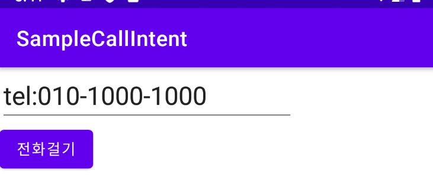
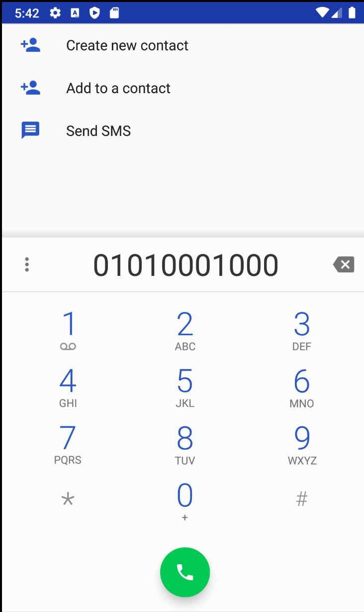

# Intent

Intent는 다른 액티비티를 띄우거나 기능을 동작시키기 위한 수단으로 사용했다.

즉, Inetet 객체를 생성 후 startActivity나 startActivityForResult 메소드를 호출하면서 전달하는 방법으로 인텐트를 시스템에 전달하였다.<br>
그러면 시스템은 그 Intent 안에 들어있는 명령을 확인하고 새로운 액티비티를 띄우는 것이다.

<br>

## Intent의 역할과 사용 방식

<br>

android.content 패키지 안에 정의되어 있는 Intent는 앱 구성 요소간에 작업 수행을 위한 정보를 전달하는 역할을 한다.

다른 앱 구성요소에 Intent를 전달할 수 있는 대표적인 메소드는 다음과 같다. <br>

-   stratActivity() 또는 startActivityForResult() : 액티비티를 화면에 띄울 때 사용한다.
-   startService() : 서비스를 시작할 때 사용한다.
-   bindService()
-   broadcastIntent() : Intent 객체를 브로드캐스팅 방식으로 전송할 때 사용한다.

<br>

Intent의 기본 구성 요소는 **Action**과 **Data**이다.

액션은 수행할 기능이고 데이터는 액션이 수행될 대상의 데이터를 의미한다.

Intent에 포함되어 있는 데이터는 그 포맷이 어떤 것인가를 시스템이 확인한 후 적절한 액티비티를 자동을 찾아 띄워주기도 한다.

<br>

인텐트의 여러 생성자
<br>

-   Intent()
-   Intent(Intent o)
-   Intent(String action [,Uri uri])
-   Intent(Context packageContext, Class<?> cls)
-   Intent(String action, Uri uri, Context packageContext, Class<?> cls)

<br>

<br>

Intent의 클래스 객체나 컴포넌트 이름을 지정하여 호출할 대상을 확실시 알 수 있는 경우에는 **명시적 인텐트**라고 하며,

액션과 데이터를 지정하긴 했지만 호출할 대상이 달라질 수 있는 경우에는 **암시적 인텐트**라고 부른다.

<br>

### 암시적 인텐트의 속성

<br>

-   범주(Category) : 액션이 실행되는 데 필요한 추가적인 정보를 제공한다. <br><br>
-   Type : Intent에 들어가는 데이터의 MIME 타입을 명시적으로 지정한다. [MIME TYPE]("https://developer.mozilla.org/ko/docs/Web/HTTP/Basics_of_HTTP/MIME_types")<br><br>
-   Component : Intent에 사용된 컴포넌트 클래스 이름을 명시적을 지정한다. 이 속성이 지정될 경우에는 지정된 컴포넌트가 실행되도록 한다.<br><br>
-   부가 데이터 : Intent는 추가적인 정보를 넣을 수 있도록 **번들 객체**를 담고 있다. 이 객체를 통해 Intent 안에 더 많은 정보를 넣어 다른 앱 구성 요소에 전달할 수 있다.

<br>

<br>

```java
public class MainActivity extends AppCompatActivity {
    EditText editText;

    @Override
    protected void onCreate(Bundle savedInstanceState) {
        super.onCreate(savedInstanceState);
        setContentView(R.layout.activity_main); //View 객체 참조

        editText = findViewById(R.id.editText);

        Button button = findViewById(R.id.button);
        button.setOnClickListener(new View.OnClickListener() {
            @Override
            public void onClick(View view) {
                String data = editText.getText().toString(); // 입력상자에 입력된 전화번호 확인

                Intent intent = new Intent(Intent.ACTION_VIEW, Uri.parse(data)); //전화걸기 화면을 보여줄 인텐트 객체 생성
                startActivity(intent); // 액티비티 띄우기

            }
        });

        Button button2 = findViewById(R.id.button2);
        button2.setOnClickListener(new View.OnClickListener() {
            @Override
            public void onClick(View view) {
                Intent intent = new Intent();
                ComponentName name = new ComponentName("org.techtown.samplecallintent",
                        "org.techtown.samplecallintent.MenuActivity");
                intent.setComponent(name);

                startActivityForResult(intent, 101);
            }
        });

    }

}
```

<br>





<br>

버튼을 누르면 입력상자에 입력된 값을 가져와 Intent의 파라미터로 전달한다.

<br>

<br>

```java
Button button2 = findViewById(R.id.button2);
        button2.setOnClickListener(new View.OnClickListener() {
            @Override
            public void onClick(View view) {
                Intent intent = new Intent();
                ComponentName name = new ComponentName("org.techtown.samplecallintent",
                        "org.techtown.samplecallintent.MenuActivity"); //컴포넌트 이름을 지정할 수 있는 객체 생성
                intent.setComponent(name); //Intent 객체에 컴포넌트 지정

                startActivityForResult(intent, 101); //액티비티 띄우기
            }
        });
```

<br>

<br>

<br>

---
