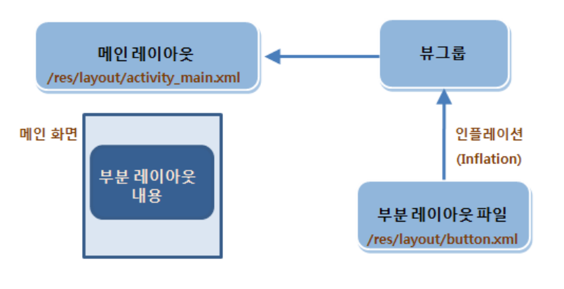
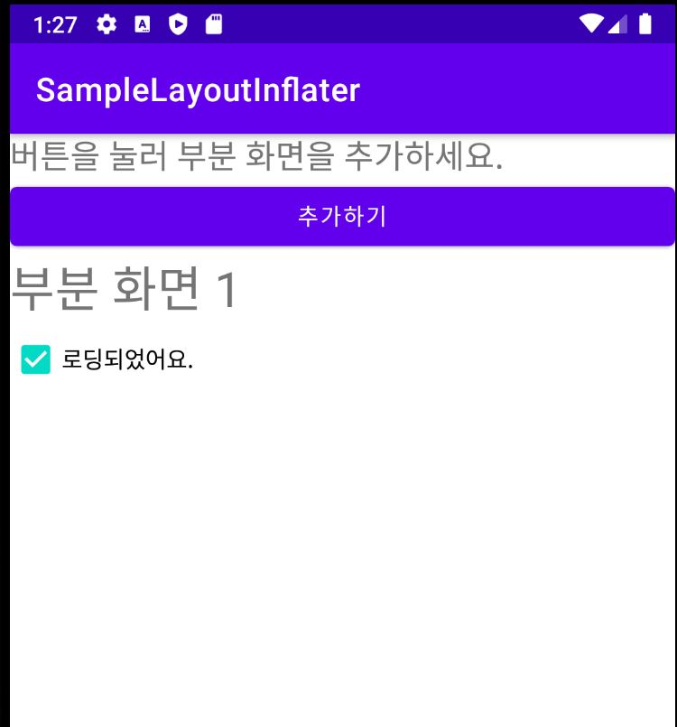

# Inflation

<br>

## 레이아웃과 액티비티의 연결

<br>

XML 레이아웃은 단순히 XML로 정의된 파일이다. 즉, 화면을 어떻게 배치하고 구성하는지만 정의할 뿐이다.

따라서 화면의 기능을 담당하는 소스 코드파일도 작성하고 분리하여 개발한다.

XML 레이아웃과 MainActivity.java와 연결되는 방법은 다음과 같다.

```java
public class MainActivity extends AppCompatActivity {
    ProgressDialog dialog;

    @Override
    protected void onCreate(Bundle savedInstanceState) {
        super.onCreate(savedInstanceState);
        setContentView(R.layout.activity_main);
```

<br>

super.onCreate 메소드는 부모 클래스에 동일한 메소드를 호출하는 것이니 사실상 setContentView 메소드가 소스 코드의 전부인 셈이다. 즉, **setContentView** 메소드가 XML 레이아웃 파일을 연결한다고 볼 수 있다.

<br>

자세히 설명해 보자면, 화면의 기능을 담당하는 소스 파일에는 **AppCompatActivity**를 상속하는 MainActivity 클래스가 자동을 만들어진다.

그런데 MainActivity 클래스가 상속하는 AppCompatActivity에는 화면에 필요한 기능들이 들어있다.

그 기능 중 하나인 setContentView 메소드에 XML 레이아웃 파일 이름을 파라미터로 전달하여 XML 레이아웃과 소스 코드를 연결한 것이다.

<br>

이때 setContentView 메소드에 전달하는 XML 레이아웃 파일의 이름은 R.layout.activity_main과 같은 방법으로 확장자 없이 지정해야 한다. (여기서 **R**은 res 폴더를 의미한다.)

실제로 앱을 실행하면 XML 레이아웃을 소스 코드에서 사용한다. 즉, 앱이 실행될 때 XML 레이아웃 내용이 메모리에 객체화되고 객체화된 XML 레이아웃을 소스 파일에서 사용한다.

**이렇게 XML 레이아웃의 내용이 메모리에 객체화되는 과정을 인플레이션(Inflation)이라고 한다.**

<br>

**XML 레이아웃은 앱이 실행되는 시점에 메모리에 객체화된다.** 즉, XML 레이아웃 파일에 \<Button>태그를 정의해도 앱은 자신이 실행되기 전까지 버튼이 있는지 모른다.

<br>

<br>

이렇게 액티비티에서 사용하는 setContentView메소드가 매우 중요하다는 것을 알 수 있다.
<br>이 메소드는 화면에 표시한 XML 레이아웃을 지정하거나 화면에 표시할 뷰 객체를 지정하는 역할을 한다.

**그렇다면 화면 전체에 보여줄 XML 레이아웃이 아니라 별도의 XML 레이아웃 파일로 만든 부분 레이아웃을 소스 파일에 로딩하여 보여줄 수는 없을까?**

setContentView메소드는 액티비티의 메인 레이아웃을 설정하는 역할만을 수행하기 때문에 부분 화면을 메모리에 객체화하려면 **인플레이터**를 사용해야한다.

<br>

<br>

<br>

## 인플레이터

**LayoutInflater** 클래스의 사용

<br>



<br>

<br>

<br>

```java
public class MenuActivity extends AppCompatActivity {
    LinearLayout container;

    @Override
    protected void onCreate(Bundle savedInstanceState) {
        super.onCreate(savedInstanceState);
        setContentView(R.layout.activity_menu);

        container = findViewById(R.id.container); //안쪽 리니어 레이아웃을 참조한다.

        Button button = findViewById(R.id.button);
        button.setOnClickListener(new View.OnClickListener() {
            @Override
            public void onClick(View view) {
                LayoutInflater inflater = (LayoutInflater) getSystemService(Context.LAYOUT_INFLATER_SERVICE);
                inflater.inflate(R.layout.sub1, container, true);
                //container를 id로 갖는 리니어 레이아웃 객체에 sub1.xml파일의 레이아웃을 설정한다.
                //sub1.xml 레이아웃 객체화.
                CheckBox checkBox = container.findViewById(R.id.checkBox);
                //부분 레이아웃은 container 객체에 설정되어있으므로 참조를 위와 같이 한다.
                checkBox.setText("로딩되었어요.");
            }
        });
    }

}
```

<br>



<br>

**inflate 메소드**는 다음과 같이 구현한다.

```java
View inflate (int resources, ViewGroup root)
```

<br>

inflate 메소드는 첫 번째 파라미터로 XML 레이아웃 리소스를, 두 번째 파라미터로 부모 컨테이너를 지정한다.

<br>

layoutInfalter 객체는 다음과 같이 호출한다.

```java
static LayoutInflater LayoutInflater.from (Context context)
```

<br>

layoutInfalter 객체는 시스템 서비스로 제공되므로 getSystemService 메소드를 호출하는 방법을 사용하거나

LayoutInflater 클래스의 from 메소드를 호출하여 참조할 수 있다.

<br>

<br>

<br>

---
