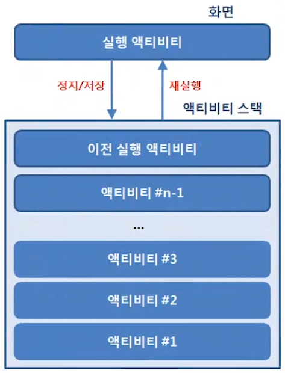
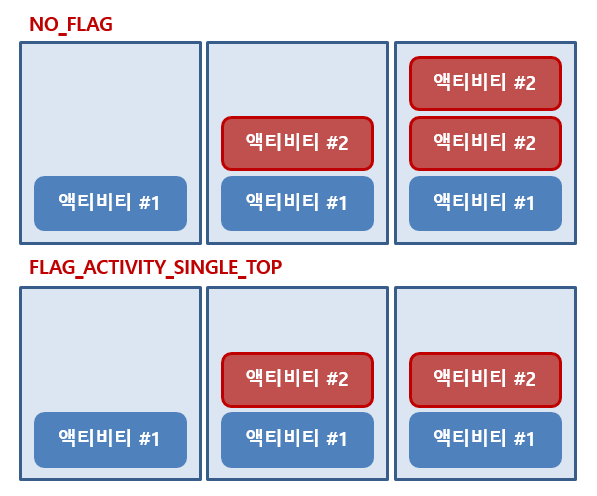
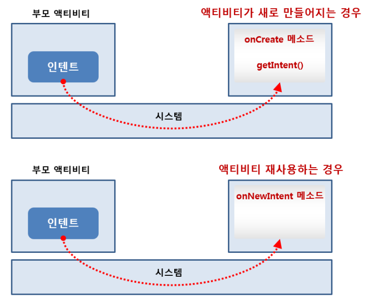
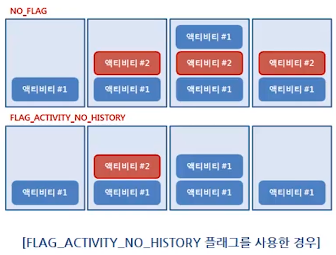
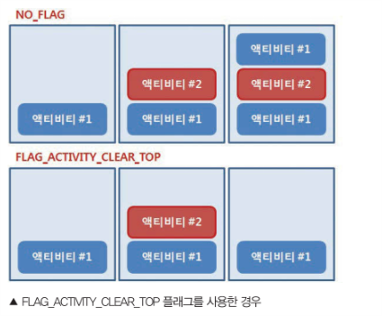
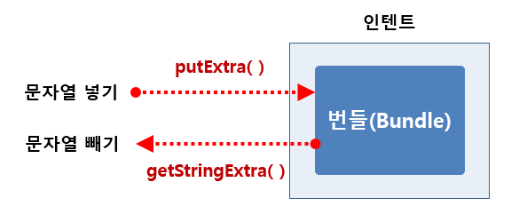

# 플래그와 부가 데이터 사용하기

<br>

만약 startActivity나 startActivityForResult 메소드를 여러 번 호출하게 되면 동일한 액티비티가 메모리에 여러 개 만들어지게 된다.

이러면 중복된 액티비티가 메모리에 쌓이게 되는데 이를 방지할라면 **Flag**을 사용하여 조정해야 한다.

<br>

## 플래그

<br>

액티비티는 ActivityManager라는 객체에 의해 **Activity Stack**로 관리된다.

그리고 이 스택은 액티비티를 쌓아두었다가 가장 상위에 있던 액티비티가 없어지면 이전의 액티비티가 다시 화면에 보이게 한다.

<br>



<br>

새로운 액티비티를 만들어 Manifest 파일에 등록하면 그 액티비티는 startActivity 또는 startActivityForResult 메소드를 사용해 실행한다.

실행된 액티비티는 화면에 띄워지고, 이전에 있던 액티비티는 액티비티 스택에 저장된다.

**즉, 새로운 화면이 보이면 이전에 화면들은 그 화면 뒤에 차곡차곡 가려져 있다고 볼 수 있다.**

<br>

### FLAG_ACTIVITY_SINGLE_TOP

<br>



<br>

액티비티를 생성할 때 이미 생성된 액티비티가 있으면 그 액티비티를 그대로 사용한다.

**만약, 화면이 보이는 액티비티가 새로 만들어지지 않고 기존에 있는 것이 보인다면 시스템에서 전달하는 Intent 객체는 어떻게 전달받는가?**

<br>

새로운 액티비티를 띄워주는 액티비티를 부모 액티비티라 부른다면, 부모 액티비티로부터 전달하는 Intent는 새로 만들어진 Intent의 onCreate 메소드 안에서 getIntent 메소드로 참조할 수 있다.

그런데 액티비티가 재사용 된다면 onCreate 메소드는 호출되지 않는다.

따라서 새로 띄워지는 액티비티에서 Intent를 전달받아 처리하는 **onNewIntent** 메소드를 재정의 한다.

<br>



<br>

onNewIntent 메소드는 액티비티가 이미 객체로 만들어져 있을 때 시스템으로부터 자동으로 호출되며 파라미터로 Intent 객체를 전달 받을 수 있다.

<br>

<br>

### FLAG_ACTIVITY_NO_HISTORY

<br>



<br>

이 플래그로 설정하면 처음 이후에 실행된 액티비티는 액티비티 스택에 추가되지 않는다.

즉, 이 플래그를 사용하면 항상 맨 처음에 실행되었던 액티비티가 바로 보이게 된다. (알람 이벤트가 발생하여 사용자에게 한 번 알림 화면을 보여주고 싶을 때 유용하다.)

<br>

만약, 홈 화면이 여러 개 있는 것이 아니라 하나만 만들어지는 것으로 하고 싶을 때 FLAG_ACTIVITY_SINGLE_TOP 플래그와 함께 설정하면 항상 하나의 객체가 메모리에 존재하면서 그 상위의 액티비티를 모두 종료시킬 수 있다.

<br>

<br>

### FLAG_ACITIVITY_CLEAR_TOP

<br>



<br>

현재 액티비티 포함하여 모든 상위의 액티비티를 종료한다.

<br>

<br>

<br>

---

<br>

## 부가 데이터

<br>

한 액티비티에서 다른 액티비티를 띄울 때 데이터를 전달해야 하는 경우가 있다.

단순히 클래스 변수를 만들어 참조하게 하는 방법도 있지만 다른 앱에 데이터를 전달해야 할 경우에는 이 방법이 불가능할 수도 있다.

따라서 액티비티를 띄울 때 전달하는 Intent 안에 부가 데이터(Extra data)를 넣어 전달하는 방법을 권장한다.

<br>

Intent 안에는 **bundle** 객체가 있는데, 번들 객체는 [해시테이블](http://wiki.hash.kr/index.php/%ED%95%B4%EC%8B%9C%ED%85%8C%EC%9D%B4%EB%B8%94)과 유사하여 **putExtra**와 **getExtra** 메소드로 데이터를 넣거나 뺄 수 있다.

<br>



<br>

기본적으로 기본 자료형을 넣었다 뺄 수 있지만, 바이트 배열이나 [Serializable](https://wooooooak.github.io/android/2019/09/19/Serializable-vs-Parcelable/) 객체도 넣었다 뺄 수 있다.

이렇게 번들 객체 안에 넣은 데이터를 **부가 데이터**라 하며 시스템에서는 건드리지 않고 다른 앱 구성요소로 전달한다.

번들 안에 문자열이나 정수같은 부가 데이터를 넣을 때는 Key나 Value을 쌍으로 만들어 넣는다.

<br>

<br>

getXXX() 형태를 가진 메소드는 데이터 값이 없음ㄴ 디폴트로 설정한 defaultValue 값이 반환된다.

또한 전달하고 싶은 데이터가 **Object 자료형인 경우에는 객체 자체를 전달할 수 없다.**

안드로이드는 객체를 전달할 때 Serializable 대신 Parcelable 인터페이스를 권장한다.

Parcelable 인터페이스는 Serializable과 유사하지만 직렬화했을 때 크기가 작아 안드로이드 내부의 데이터 전달에 자주 사용된다.

이 인터페이스를 사용하려면 객체를 직접 번들에 추가하여 데이터를 전송할 때 사용할 수 있다.

**구현해야 하는 메소드**

-   public abstract int describeContents() : 직렬화하려는 객체의 유형을 구분한다.
-   public abstract void writeToParcel(Parcel dest, int flags) : 객체가 가지고 있는 데이터를 Parcel 객체로 만들어 준다.

이 메소드들을 구현한 다음 **CREATOR**이라는 상수를 만들어야 하는데 이 상수는 Parcel 객체로부터 데이터를 읽어 들여 객체를 생성하는 역할을 한다. (**반드시 static final로 선언되어야 한다.**)

<br>

<br>

```java
//SimpleData
public class SimpleData implements Parcelable {

    int number;
    String message;

```

SimpleData 클래스는 Parcelable 인터페이스를 구현하므로 implements Parcelable 코드가 추가된다.

클래스 안에 정의된 인스턴스 변수는 2개이며, 하나는 문자열이고 하나는 정수이다.

<br>

```java
    public SimpleData(int num, String msg) {
        number = num;
        message = msg;
    }

    public SimpleData(Parcel src) { //Parcel 객체에서 읽기
        number = src.readInt();
        message = src.readString();
    }
```

SimpleData 클래스의 생성자에는 Parcel 객체를 파라미터로 받아 readInt와 readStirng 메소드를 이용해 데이터를 읽는다.

<br>

```java
    public static final Creator CREATOR = new Creator() { //CREATOR 상수 정의

        public SimpleData createFromParcel(Parcel in) { // SimpleData 생성자를 호출해 Parcel 객체에서 읽기
            return new SimpleData(in);
        }

        public SimpleData[] newArray(int size) {
            return new SimpleData[size];
        }

    };
```

CREATOR 객체는 상수로 정의되어 있으며 새로운 객체가 만들어지는 코드가 들어가므로 new SimpleData()와 같이 SimpleData 객체를 만든다.

결과적으로 SimpleData 클래스안에 Parcel 객체의 데이터를 읽는 부분과 Parcel 객체로 쓰는 부분을 정의한다.

<br>

```java
    public int describeContents() {
        return 0;
    }

    public void writeToParcel(Parcel dest, int flags) { //Parcel 객체로 쓰기
        dest.writeInt(number);
        dest.writeString(message);
    }

}
```

writeToParcel 메소드는 이 SimpleData 객체 안에 들어있는 데이터를 Parcel 객체로 만든다.

그래서 이 메소드 안에는 writeInt와 writeString 메소드가 있다.

<br>

<br>

<br>

```java
//MainActivity
public class MainActivity extends AppCompatActivity {
    public static final int REQUEST_CODE_MENU = 101;
    public static final String KEY_SIMPLE_DATA = "data";

    @Override
    protected void onCreate(Bundle savedInstanceState) {
        super.onCreate(savedInstanceState);
        setContentView(R.layout.activity_main);

        Button button = findViewById(R.id.button);
        button.setOnClickListener(new View.OnClickListener() {
            @Override
            public void onClick(View v) {
                Intent intent = new Intent(getApplicationContext(), MenuActivity.class); //SimpleData객체 생성
```

```java
                SimpleData data = new SimpleData(100, "Hello Android!");
```

정수와 문자열이 담긴 데이타가 Parcel 객체로 생성된다.

```java
                intent.putExtra(KEY_SIMPLE_DATA, data); //Intent에 부가 데이터로 넣기

                startActivityForResult(intent, REQUEST_CODE_MENU);
            }
        });

    }
}
```

Intent 객체의 putExtra 메소드를 사용해 SimpleData 객체를 부가 데이터로 추가했다면 이 SimpleData 객체는 MenuActivity에서 꺼내어 사용할 수 있다.

<br>

<br>

<br>

```java
public class MenuActivity extends AppCompatActivity {
    TextView textView;
    public static final String KEY_SIMPLE_DATA = "data";

    @Override
    protected void onCreate(Bundle savedInstanceState) {
        super.onCreate(savedInstanceState);
        setContentView(R.layout.activity_menu);

        textView = findViewById(R.id.textView);
        Button button = findViewById(R.id.button);
        button.setOnClickListener(new View.OnClickListener() {
            public void onClick(View v) {
                Intent intent = new Intent();
                intent.putExtra("name", "mike");
                setResult(RESULT_OK, intent);

                finish();
            }
        });

        Intent intent = getIntent();
        processIntent(intent);
    }
```

MainActivity로부터 전달 받은 Intent 객체를 참조하기 위해 OnCreate 메소드 안에서 getIntent 메소드를 호출한다.

getIntent 메소드를 호출하면 Intent 객체가 반환되므로 이 객체 안의 번들 객체를 참조할 수 있다.

getExtras 메소드를 호출하면 번들 자료형의 객체가 반환된다.

이렇게 번들 객체를 참조한 후, getXXX() 형태의 메소드를 사용해도 되고, 번들 객체를 참조하지 않고 Intent 객체에 정의되어 있는 get_XXX_EXtra() 형태의 메소드를 활용해도 된다.

getParcelable 메소드로 객체를 참조한 후 화면의 텍스트뷰에 전달 받은 데이터를 보여준다.

```java

    private void processIntent(Intent intent) {
        if (intent != null) {
            Bundle bundle = intent.getExtras();
            SimpleData data = bundle.getParcelable(KEY_SIMPLE_DATA);
            if (data != null) {
                textView.setText("전달 받은 데이터\nNumber : " + data.number
                        + "\nMessage : " + data.message);
            }
        }
    }

}
```

<br>

Parcelable 인터페이스를 사용하면 객체를 정의하여 데이터를 전달할 수 있으므로 코드가 좀더 단순해지고 재사용성이 높아진다.

<br>

<br>

<br>

---
