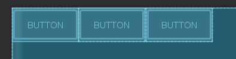
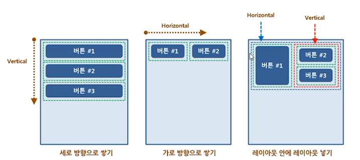
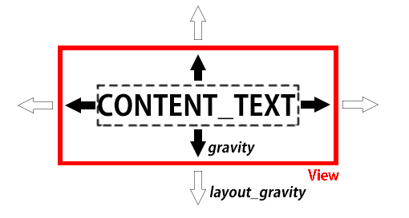
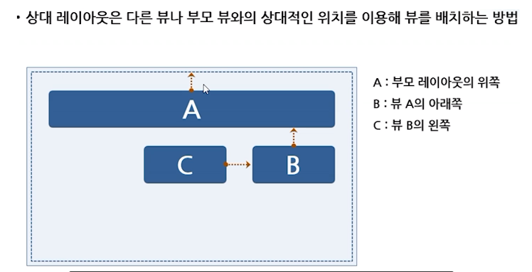
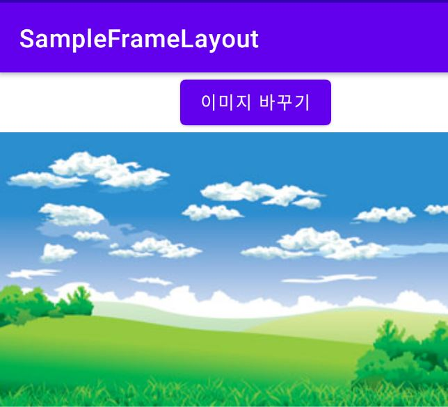
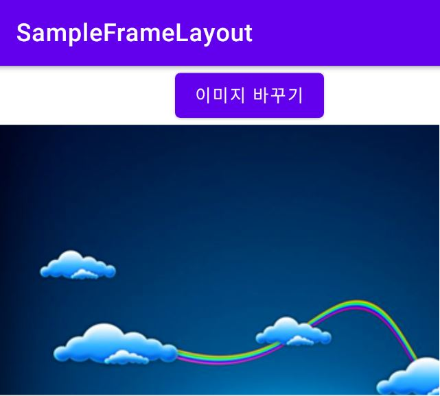

# 안드로이드 대표적인 레이아웃

-   ConstraintLayout : 제약 조건 기반 모델
    -   연결선을 제약 조건으로 하여 화면을 구성하는 방법
    -   안드로이드 스튜디오에서 자동으로 설정하는 디폴드 레이아웃<br><br>
-   LinearLayout : 박스 모델
    -   한 쪽 방향으로 차례대로 뷰를 추가하여 화면을 구성하는 방법
    -   뷰가 차지할 수 있는 사각형 영역을 할당한다.<br><br>
-   RelativeLayout : 규칙 기반 모델
    -   부모 컨테이너나 다른 뷰와의 상대적 위치로 화면을 구성하는 방법
    -   제약 레이아웃을 사용하게 되면서 상대 레이아웃은 권장하지 않는다. <br><br>
-   FrameLayout : 싱글 모델
    -   가장 상위에 있는 하나의 뷰 또는 뷰그룹만 보여주는 방법
    -   여러 개의 뷰가 들어가면 중첩하여 쌓게 됨. 가장 단순하지만 여러 개의 뷰를 중첩한 후 각 뷰를 전환하여 보여주는 방식으로 자주 사용한다.<br><br>
-   TableLayout : 격자 모델
    -   격자 모양의 배열을 사용하여 화면을 구성하는 방법
    -   HTML에서 많이 사용하는 정렬 방식과 유사하지만 많이 사용하지 않는다.

<br><br>

# LinearLayout

<br>

리니어 레이아웃은 박스 모델을 사용하는 레이아웃이다. 가로 방향은 Horizontal, 세로 방향은 Vertical로 지정한다.

<br>

```java
<LinearLayout xmlns:android="http://schemas.android.com/apk/res/android"
    xmlns:app="http://schemas.android.com/apk/res-auto"
    xmlns:tools="http://schemas.android.com/tools"
    android:layout_width="match_parent"
    android:layout_height="match_parent"
    android:orientation="horizontal"
    tools:context=".MainActivity">
```

linearlayout의 orientation 속성 값을 Horizontal 또는 Vertical로 변경할 수 있다.


(가로로 버튼을 쌓는다.)

<br>
<br>

화면에서 뷰가 차지하는 영역을 상자라고 보고 이 상자를 한쪽 방향으로 쌓을 수 있게 해주기 때문에 방향을 꼭 지정해야한다.

<br>



<br>

<br>

<br>

## Java에서 레이아웃 구성하기

<br>

**Context : 객체의 정보를 담고 있는 객체를 의미한다. 안드로이드는 UI 구성 요소인 뷰에 대한 정보를 손쉽게 확인하거나 설정할 수 있도록 뷰의 생성자에 Context 객체를 전달하도록 한다.**

<br>

XML 파일에서 화면을 구성하려면 [MainActivity.java]에서 **setContentView**메소드를 호출한다.

이 메소드를 호출하면서 activity_main.xml 파일을 파라미터로 전달하면 이 레이아웃 파일이 액티비티라고 불리는 소스 파일과 연결된다.

<br>

```java
public class SampleLayoutCodeActivity extends Activity {

    @Override
    protected void onCreate(Bundle savedInstanceState) {
        super.onCreate(savedInstanceState);
```

상속을 받은 부모 클래스가 가지는 동일한 이름의 onCreate()함수를 호출한다.

<br>

<br>

```java
        LinearLayout mainLayout = new LinearLayout(this);
        mainLayout.setOrientation(LinearLayout.VERTICAL);
```

뷰 객체를 코드에서 만들 때 뷰의 생성자에는 항상 Context 객체가 전달되어야 하는데 액티비티는 Context를 상속하므로 액티비티 클래스 안에서는 this를 Context 객체로 사용할 수 있다.

new 연산자로 리니어 레이아웃을 만들고 방향 설정

<br>

<br>

```java

        LinearLayout.LayoutParams params = new LinearLayout.LayoutParams(
                ViewGroup.LayoutParams.MATCH_PARENT,
                ViewGroup.LayoutParams.WRAP_CONTENT);

```

new 연산자로 레이아웃 안에 추가될 뷰들에 설정할 파라미터 생성

LayoutParams 객체를 새로 만들 경우에는 반드시 뷰가 추가될 영역에 대한 기본 fill 속성을 지정해야 하며,

이때 사용하는 두 속성인 **LayoutParams.MATCH_PARENT**와 **LayoutParams.WRAP_CONTENT** 중 하나가 사용된다.

<br>

<br>

```java

        Button button01 = new Button(this);
        button01.setText("Button01");
        button01.setLayoutParams(params);

        mainLayout.addView(button01);
        setContentView(mainLayout);
    }
}
```

뷰그룹에 뷰를 추가하기 위해 addView를 사용한다.

addView 메소드는 필요한 경우 LayoutParams 객체를 같이 전달할 수도 있다.
mainLayout.addView(button01, params);

R.layout.main과 같이 XML레이아웃으로 정의된 리소스가 아니라 자바 코드에서 만든 뷰그룹을 화면에 생성한다.
XML 레이아웃에서 정의할 수 있는 대부분의 속성들은 자바에서 객체로 만들거나 객체의 메소드를 호출하여 설정할 수 있다.

<br>

<br>

<br>

<br>

## View 정렬하기

<br>

일반적인 정렬은 순서대로 놓인다는 의미로 이해할 수 있는데 안드로이드는 gravity라는 속성 이름을 사용한다.

이 속성은 어느 쪽에 무게 중심을 놓을 것인가에 대한 의미로 해석할 수 있다.

<br>



<br>

-   layout_gravity : **부모의 여유 공간**에 뷰가 모두 채워지지 않아 여유 공간이 생겼을 때 여유 공간 안에서 뷰를 정렬한다.
    -   width나 height의 속성을 wrap_content로 만든 후에 같이 사용할 수 있다. <br><br>
-   gravity : **뷰 안에** 표시하는 내용물을 정렬한다.<br> (텍스트 뷰의 경우 내용물은 글자가 되고, 이미지 뷰의 경우 내용물은 이미지가 된다.)

<br>

<br>

## View의 Marin, Padding

<br>

뷰의 영역은 테두리선으로 표시할 수 있는데, 보이게 할 수도 있고 보이지 않게 할 수도 있다.

뷰는 테두리선을 기준을 바깥 공간과 안쪽 공간이 있으며, 이 모든 공간을 포함한 뷰의 공간을 **Cell**이라고 한다.

테두리선을 기준으로 바깥은 Margin, 안쪽 공간은 Padding이라 한다.

<br>

<br>

## layout_weight 속성

<br>

부모 레이아웃에 추가한 뷰들의 공간을 제외한 여유 공간은 layout_weight 속성으로 분할할 수 있다.

layout_weight 속성에 숫자값을 넣으면 그 숫자는 분할 비율이 되며, 그 값의 비율만큼 여유 공간을 분할한 후 해당 뷰에게 할당한다.

**(이렇게 지정하는 뷰의 크기는 wrap_content나 숫자 값으로 지정되어야 한다.)**

<br>

<br>

<br>

<br>

<br>

# RelativeLayout

<br>

상대 레이아웃은 부모 컨테이너, 즉 부모 레이아웃과의 상대적 위치 또는 같은 레이아웃 안에 들어있는 다른 뷰와의 상대적 위치를 이용해 화면을 배치하는 레이아웃이다.

<br>



<br>

<br>

<br>

상대 레이아웃에서 부모 레이아웃과의 상대적 위치를 이용해 뷰를 배치할 수 있는 속성들

-   layout_alignParentTop : 부모 컨테이너의 위쪽과 뷰의 위쪽을 맞춘다.
-   layout_alignParentBottom : 부모 컨테이너의 아래쪽과 뷰의 아래쪽을 맞춘다.
-   layout_alignParentLeft : 부모 컨테이너의 왼쪽 끝과 뷰의 왼쪽 끝을 맞춘다.
-   layout_alignParentRight : 부모 컨테이너의 오른쪽 끝과 뷰의 오른쪽 끝을 맞춘다.
-   layout_centerHorizontal : 부모 컨테이너의 수평 방향 중앙에 배치한다.
-   layout_centerVertical : 부모 컨테이너의 수직 방향 중앙에 배치한다.
-   layout_centerlnParent : 부모 컨테이너의 수평과 수직 방향 중앙에 배치한다.

<br>

<br>

# FrameLayout

<br>

프레임 레이아웃은 가장 위에 있는 하나의 뷰만 화면에 보여준다. 만약 그 안에 여러개의 뷰나 뷰그룹을 추가했다면 나머지는 그 아래에 중첩되어 쌓인다.<br>

-   많은 뷰를 중첩시켜놓고 화면을 전환하는 용도로 많이 쓰인다.
-   한번에 하나의 뷰만 보여준다.

<br>

### 가시성

프레임 레이아웃은 뷰를 하나 이상 추가할 경우 추가된 순서로 차곡차곡 쌓인다. 프레임

이때 가장 위에 있는 뷰를 보이지 않게 하면 그 다음 뷰가 보이게 된다.

Visiblity 속성을 사용해서 특정 뷰를 보이거나 보이지 않게 하면 화면의 뷰가 전환되는 효과를 만들 수 있다.

<br>

```java
    private void changeImage() {
        if (imageIndex == 0) {
            imageView.setVisibility(View.VISIBLE);
            imageView2.setVisibility(View.INVISIBLE);
            imageIndex = 1;
        } else if (imageIndex == 1) {
            imageView.setVisibility(View.INVISIBLE);
            imageView2.setVisibility(View.VISIBLE);
            imageIndex = 0;
        }
    }
```

<br>

위 코드를 보면 함수가 호출될 때마다 두 이미지를 전환하는 효과를 **setVisiblitiy**에서

VISIBLE과 INVISIVBLE로 통해 구현한다.

<br>




<br>

<br>

<br>

# TableLayout

<br>

테이블 레이아웃은 그 안에 들어가는 뷰들을 격자 형태로 만들어 주는 레이아웃이다. 테이블 레이아웃은 HTML에서 사용하는 방식과 유사하며 실용적이지만 제약 레이아웃과 리니어 레이아웃으로도 화면 배치를 할 수 있어 자주 사용하지는 않는다.

<br>

<br>

## ScrollView

<br>

스크롤뷰는 하나의 뷰나 뷰그룹을 넣을 수 있고, 어떤 뷰의 내용물이 넘치면 스크롤을 만들 수 있게 도와준다.

뷰를 배치하는 목적을 가진 레이아웃이라기 보다는 단순히 뷰를 담고 있는 뷰그룹의 역할을 한다.

<br>

<br>

---
