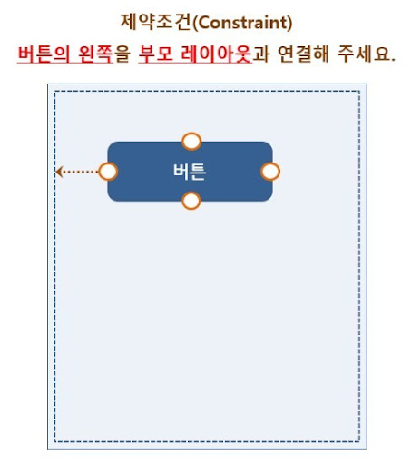

# Constraint Layout 및 레이아웃 기본

## 제약 조건

<br>

제약 레이아웃의 가장 큰 특징은 뷰의 위치를 결정할 때 제약 조건을 사용한다는 것이다.

제약 조건이란 뷰가 레이아웃 안의 다른 요소와 어떻게 연결되는지 알려주는 것으로, 뷰의 연결점과 대상을 연결한다.

<br>


<br>

핸들이라고 부르는 연결점은 타깃이 필요하다.

-   같은 부모 레이아웃 안에 들어있는 다른 뷰의 연결점
-   부모 레이아웃의 연결점
-   가이드 라인

대상 뷰와 타깃의 연결점은 다음과 같은 것들이 해당된다.

-   Top, Bottom, Left, Right
-   start, end
-   CenterX, CenterY
-   BaseLine(텍스트를 보여주는 뷰인 경우에만 해당한다.)

<br>

**바이어스**는 한쪽으로 얼마나 치우쳐 있는지를 나타내는 것으로 기본 값은 50이다.

Vertical Bias, Horizontal Bias가 있다.

<br>
<br>

### XML 코드 이해하기

```java

<?xml version="1.0" encoding="utf-8"?>
<androidx.constraintlayout.widget.ConstraintLayout xmlns:android="http://schemas.android.com/apk/res/android"
    xmlns:app="http://schemas.android.com/apk/res-auto"
    xmlns:tools="http://schemas.android.com/tools"
    android:layout_width="match_parent"
    android:layout_height="match_parent">

```

가장 위쪽에 있는 줄은 XML 파일에 일반적으로 추가하는 정보이며, 이 파일이 XML 형식으로 된 것임을 알려준다.

그 다음에 입력되어 있는 태그가 화면 전체를 감싸고 있는 레이아웃이며, Component Tree 창의 계층도에서 가장 위쪽에 있으므로 **최상위 레이아웃**이라 부른다.

여기에는 ConstraintLayout이 태그의 이름으로 사용되었다. 그리고 그 앞에 붙어있는 패키지이름은 외부 라이브러리에서 불러온 것이라면 반드시 같이 입력해야 한다.

(ConstraintLayout은 안드로이드 SDK에 나중에 추가되면서 외부 라이브러리로 분류되어 있다.)

<br>

하단 쪽의 태그의 속성을 보면 **xmlns:**로 시작하는 속성들이 있다. 그 중에서 xmlns:android 속성은 XML 레이아웃 파일이라면 한 번씩 넣어주어야 하는 속성이다. xmlns 뒤의 이름이 나머지 속성의 접두어로 사용된다.

-   xmlns:android : 안드로이드 기본 SDK에 포함되어 있는 속성을 사용한다.
-   xmlns:app : 프로젝트에서 사용하는 외부 라이브러리에 포함되어 있는 속성을 사용한다.
-   xmlns:tools : 안드로이드 스튜디오의 디자이너 도구 등에서 화면에 보여줄 때 사용한다. 이 속성은 앱이 실행될 때는 적용되지 않고 안드로이드 스튜디오에서만 적용된다.

<br>
따라서 android:layout_(width/height) 또한 안드로이드 기본 SDK에 들어있는 속성이다.

<br>
<br>
<br>

ConstraintLayout 태그 안에 들어 있는 태그 속성 중에서는 android:id 속성이 있다.

이 속성은 뷰를 구분하는 **구분자** 역할을 한다. id 속성이 사용되는 용도는 크게 2가지로 나눌 수 있다.

-   XML 레이아웃 파일 안에서 뷰를 구분할 때
-   XML 레이아웃 파일에서 정의한 뷰를 자바 소스 파일에서 찾을 때

XML 레이아웃 파일 안에는 여러 개의 뷰를 추가할 수 있고, 추가한 각각의 뷰는 다른 뷰의 왼쪽이나 오른쪽 등에 연결될 수 있다. 이 때 다른 뷰가 어떤 것인지 지정할 필요가 있는데 그 목적으로 id 속성 값이 사용된다.

<br>

제약 레이아웃에서 하나의 뷰를 다른 뷰와 연결할 때 사용하는 XML 속성의 이름은 다음과 같은 규칙을 갖는다.

    layout_constraint[소스 뷰의 연결점]_[타깃 뷰의 연결점] = "[타깃 뷰의 id]"

여기에서 id 속성 값은 다음과 같은 형식으로 정의되고 사용된다.

    @+id/아이디 값

<br>
<br>

```java
<androidx.constraintlayout.widget.Guideline
        android:id="@+id/guideline2"
        android:layout_width="wrap_content"
        android:layout_height="wrap_content"
        android:orientation="vertical"
        app:layout_constraintGuide_begin="50dp" />
```

Guideline 클래스는 외부 라이브러리에 들어 있어 패키지 이름과 함께 붙여준다.

태그에는 필수 속성인 width와 height 속성과 값이 들어있고, id값으로 @+id/guideline이 설정되어 있다. 그다음으로 android:orientation 속성이 들어있는데 가이드 라인은 가로, 세로 방향을 지정을 해주어야 함으로 orientation또한 필수 속성이다.

그 아래에는 layout_constraintGuide_begin 속성이 있다. 이 속성은 부모 레이아웃 벽면에서 얼마나 떨어뜨려 배치할지 지정하는 속성 중 하나이다. 부모 레이아웃 벽면에서 얼마나 떨어뜨릴 건지 지정하려면 다음과 같이 세 가지 속성중의 하나를 사용한다.

-   layout_constraintGuide_begin : 세로 방향인 경우 왼쪽부터, 가로 방향인 경우 위쪽부터의 거리 지정
-   layout_constraintGuide_end : 세로 방향인 경우 오른쪽부터, 가로 방향인 경우 아래쪽부터의 거리 지정
-   layout_constraintGuide_percent : layout_constraintGuide_begin 속성 대신 지정하되 % 단위로 거리 지정

<br>
<br>
<br>

### 크기를 표시하는 단위와 마진

<br>
XML 레이아웃에서 뷰의 폭과 높이는 일반적으로 match_parent와 wrap_content 값을 지정하는 방식으로 사용하는데 그 이유는 해상도나 화면의 크기가 달라도 전체 화면을 기준으로 뷰를 배치할 수 있기 때문이다.

뷰의 크기를 픽셀 값으로 지정하면 해상도에 따라 그 크기가 다르게 보이지만, match_parent나 wrap_content를 사용하면 아주 쉽게 여러 단말의 해상도를 지원할 수 있다.

뷰의 폭과 높이를 정수 값으로 지정하면서도 픽셀 단위가 아니라 dp나 sp와 같은 단위를 사용하면 해상도가 다른 단말에서도 뷰의 크기를 비슷하게 보이도록 할 수 있다.

-   px : 화면 픽셀의 수
-   dp : 밀도 독립적 픽셀. 160dpi 화면을 기준으로 한 픽셀
-   sp : 축척 독립적 픽셀. 텍스트 크기를 지정할 때 사용하는 단위.
-   in : 인치. 1인치로 된 물리적 길이
-   mm : 밀리미터
-   em : 텍스트 크기. 글꼴과 상관없이 동일한 텍스트 크기 표시

---
