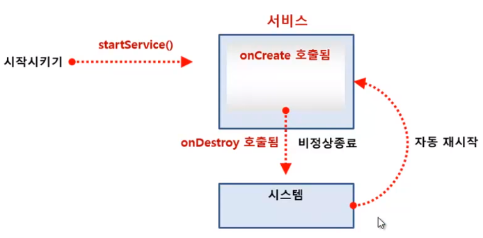

# 서비스

 

서비스는 백그라운드에서 실행되는 앱의 구성 요소를 말한다.

액티비티와 동일하게 서비스도 앱의 구성 요소 역할을 한다. 따라서 시스템에서 관리를 하므로 Manifest 파일에서 등록을 해야한다.

## 서비스의 실행원리와 역할

 

 

서비스를 실행하려면 MainActivity에서 startService 메소드를 호출한다. 
이 메소드를 호출할 때는 Inetent 객체를 파라미터로 전달한다.

서비스의 주요 역할 중 하나는 **단말이 항상 실행되어 있는 상태로 다른 단말과 데이터를 주고받거나 필요한 기능을 백그라운드에서 실행하는 것이다.**

따라서 서비스가 비정상적으로 종료되더라도 시스템에서 자동으로 재실행된다.

 

액티비티에서 서비스로 데이터를 전달하려면 Intent 객체를 만들고 부가 데이터를 넣은 후 startService 메소드를 호출하면서 전달하면 된다.

그런데 서비스가 이미 메모리에 만들어져 실행되어 있는 상태에서 Intent를 전달하는 목적으로 메소드를 실행하면

시스템이 onCreate 메소드가 아니라 onStartCommand 메소드를 실행한다. **onStartCommand** 메소드는 서비스에 전달된 인텐트 객체를 처리하는 메소드이다.
