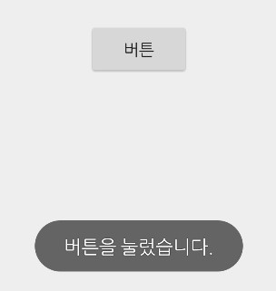

# 토스트, 스낵바 그리고 대화상자 사용하기

<br>

## 토스트

토스트는 간단한 메시지를 잠깐 보여주었다가 없어지는 뷰로 앱 위에 떠있는 뷰라고 할 수 있다.

이는 대화상자와 함께 사용자에게 필요한 정보를 알려주는 역할을 하는 대표적인 위젯이다.

토스트는 **포커스를 받지 않으므로** 대화상자보다 더 쉽고 간단하게 사용할 수 있으며 디버깅 등의 목적으로 사용할 수도 있다. 특히 **앱이 화면에서 사라지더라도 필요한 메시지가 그대로 표시되므로** 앱의 상태와 관계없이 보여줄 수 있다.



<br>

```java
Toast.makeText(Context context, Stirng message, int duration).show();
```

<br>

Context 객체는 일반적으로 Context 클래스를 상속한 액티비티를 사용할 수 있으며 액티비티를 참조할 수 없는 경우에는 **getApplicationContext**메소드를 호출하면 Context 객체가 반환된다.

<br>

토스트의 위치와 여백을 지정하는 메소드

```java
public void setGravity(int gravity, int xOffset, int yOffset)
public void setMargin(float horizontalMargin, float verticalMargin)
```

<br>

**setGravity** 메소드는 토스트 뷰가 보이는 위치를 지정하는데 사용된다. 첫 번째 파라미터인 gravity 값은 Gravity.CENTER와 같이 정렬 위치를 지정한다.

**setMargin** 메소드는 외부 여백을 지정하는 것으로 이 값을 이요해 토스트를 중앙이나 우측 하단에 배치할 수 있다.

<br>

<br>

```java
public void onButton1Clicked(View v) {
        LayoutInflater inflater = getLayoutInflater();
```

레이아웃 인플레이터 객체 참조

```java
        View layout = inflater.inflate(
                R.layout.toastborder,
                (ViewGroup) findViewById(R.id.toast_layout_root));

        TextView text = layout.findViewById(R.id.text);
```

토스트를 위한 레이아웃 인플레이션

```java
        Toast toast = new Toast(this); //토스트 객체 생성
        text.setText("모양 바꾼 토스트");
        toast.setGravity(Gravity.CENTER, 0, -100);
        toast.setDuration(Toast.LENGTH_SHORT);
        toast.setView(layout); //토스트가 보이는 뷰 설정

        toast.show();

    }
```

<br>

LayoutInflater 객체를 사용해 XML로 정의된 레이아웃을 메모리에 객체화하고 있다.

액티비티를 위해 만든 XML 레이아웃 파일은 setContentView 메소드를 사용해 액티비티에 설정되지만
<br>토스트만을 위한 레이아웃을 정의하면 이 레이아웃은 액티비티를 위한 것이 아니기 때문에 LayoutInflater 객체를 사용해 직접 메모리에 객채화해야한다.

<br>

<br>

<br>

## 스낵바

<br>

간단한 메시지를 보여줄 때 토스트 대신 스낵바를 사용하는 경우도 많다.

<br>


<br>

```java
 public void onButton2Clicked(View v) {
        Snackbar.make(v, "스낵바입니다.", Snackbar.LENGTH_LONG).show();
    }
```

<br>

스낵바는 화면 아래쪽에서 올라오기 때문에 아래쪽의 화면 일부분을 가리지만 토스트와는 다른 방식으로 메시지를 보여줄 수 있다는 장점이 있다.

<br>

<br>

<br>

## 알림 대화상자

<br>

토스트와 함께 많이 사용되는 알림 대화상자는 사용자에게 확인을 받거나 선택하게 할 때 사용한다.

보통 알림 대화상자는 사용자의 입력을 받기보다는 일방적으로 메시지를 전달하는 역할을 주로 하며 '예', '아니오'와 같은 전형적인 응답을 처리한다.

<br>

```java
private void showMessage() {
        AlertDialog.Builder builder = new AlertDialog.Builder(this);
```

대화장자를 만들기 위한 빌더 객체 생성

```java
        builder.setTitle("안내");
        builder.setMessage("종료하시겠습니까?");
        builder.setIcon(android.R.drawable.ic_dialog_alert);

        builder.setPositiveButton("예", new DialogInterface.OnClickListener() {

            public void onClick(DialogInterface dialog, int whichButton) {
                String message = "예 버튼이 눌렸습니다. ";
                textView.setText(message);
            }
        });
```

'예' 버튼 추가

```java
        builder.setNeutralButton("취소", new DialogInterface.OnClickListener() {

            public void onClick(DialogInterface dialog, int whichButton) {
                String message = "취소 버튼이 눌렸습니다. ";
                textView.setText(message);
            }
        });
```

'취소' 버튼 추가

```java
        builder.setNegativeButton("아니오", new DialogInterface.OnClickListener() {

            public void onClick(DialogInterface dialog, int whichButton) {
                String message = "아니오 버튼이 눌렸습니다. ";
                textView.setText(message);
            }
        });
        AlertDialog dialog = builder.create();

        dialog.show();
    }
```

'아니요' 버튼 추가

<br>

AlertDialog 클래스는 알림 대화상자를 보여주는 가장 단순한 방법을 제공한다.

알림 대화상자의 타이틀은 **setTitle** 메소드로 지정하고

내용은 **setMessage** 메소드를 사용해 설정한다.

아이콘은 **setIcon** 메소드로 사용해 설정한다.

'예', '아니오'와 같은 버튼의 설정은 **setPositiveButton**과 **setNegativeButton** 메소드를 사용한다.
이 메소드에는 OnClickListener를 설정할 수 있다.

<br>

<br>

---
